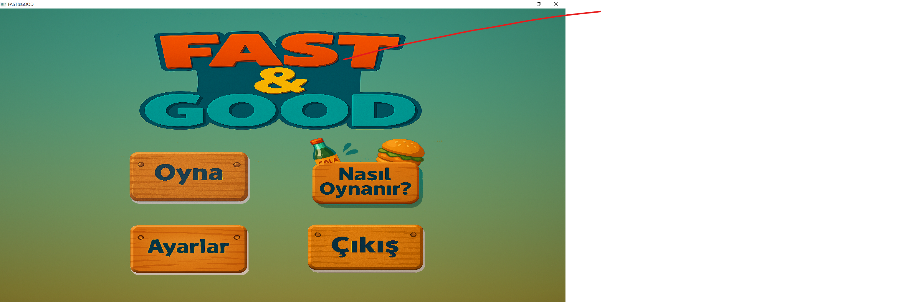
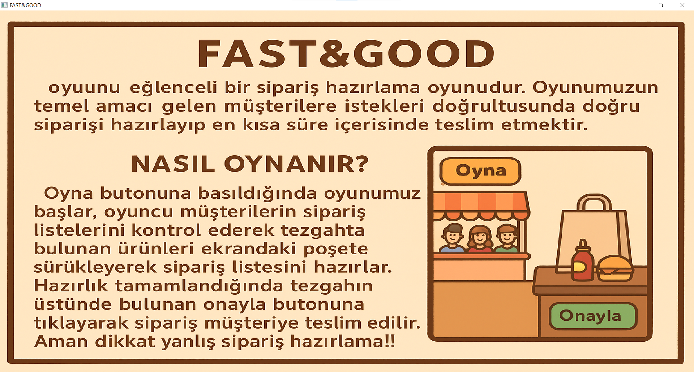
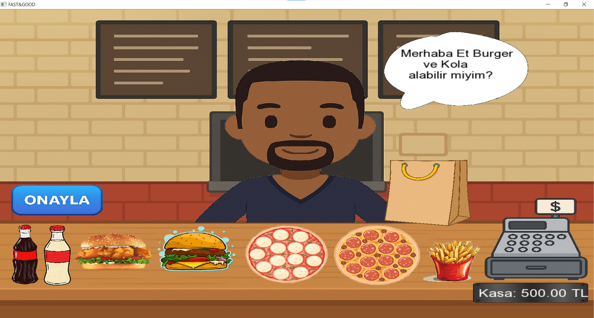
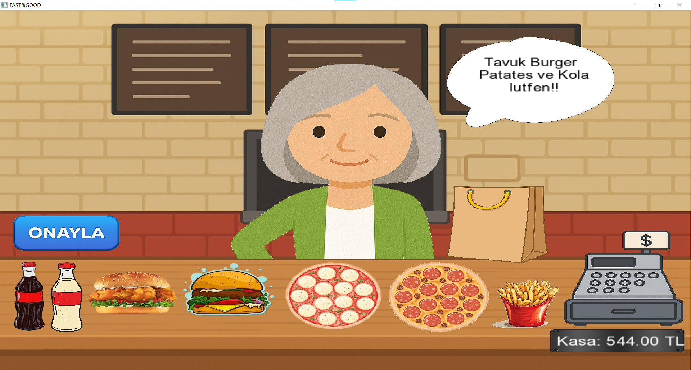
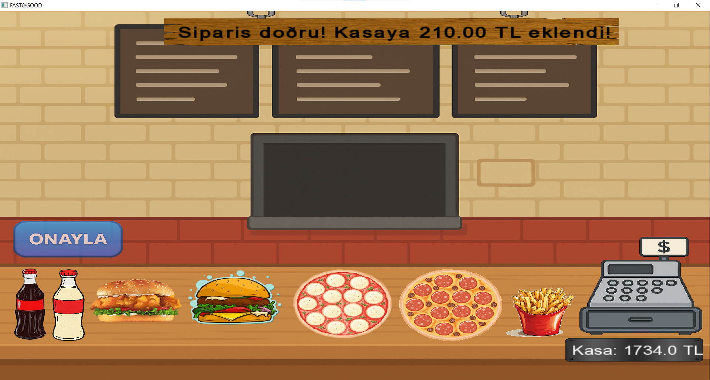

# Fast&Good

Fast&Good, C++ ve SFML kullanılarak geliştirilmiş basit bir yemek siparişi hazırlama ve dükkân yönetimi prototipidir.

## Proje Hakkında

Oyunda farklı müşteri prototipleri rastgele şekilde ekrana gelir. Her müşteri, önceden hazırlanmış sipariş metinlerinden rastgele bir sipariş verir.

Oyuncu, tezgahta bulunan ürünleri müşterinin yanındaki poşete sürükleyerek siparişi hazırlamaya çalışır. Sipariş hazırlandıktan sonra onayla butonuna basılır.

Sistem, poşette bulunan ürünleri ve miktarları kontrol eder.

- Eğer sipariş doğruysa, ürünlerin satış fiyatına göre kasaya para eklenir.
- Ürünler poşete bırakılırken, ürünlerin maliyeti kadar para kasadan düşer.
- Eğer sipariş yanlış hazırlanırsa oyuncu zarar eder.

Bu proje bir ders projesi için geliştirilmiş prototip bir oyundur.

## Özellikler

- Rastgele müşteri sistemi
- Rastgele sipariş metinleri
- Sürükle-bırak mekanığı
- Sipariş doğrulama sistemi
- Kasa / bakiye sistemi
- Menü ekranı
- Dosyaya yazdırma sistemi

## Kullanılan Teknolojiler

- C++
- SFML
- Visual Studio

## Çalıştırma

1. Projeyi Visual Studio ile açın.
2. SFML kütüphanesinin kurulu ve bağlı olduğundan emin olun.
3. assets klasörünün doğru yerde olduğundan emin olun.
4. Projeyi derleyip çalıştırın.

## Screenshots

## Gameplay Video

[Watch video](docs/game_video.mp4)

## Not

Bu proje prototip aşamasındadır. Bazı gelişmiş oyun ve ekonomi kontrolleri henüz tam olarak eklenmemiştir.
